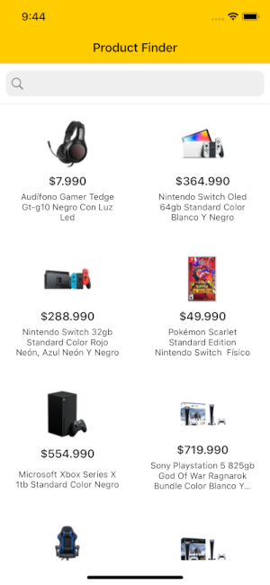
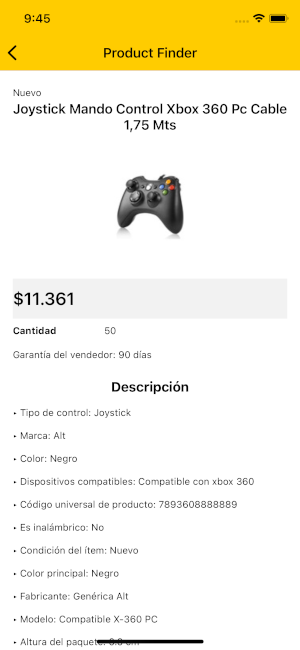
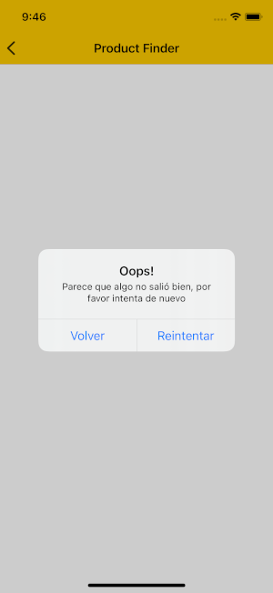
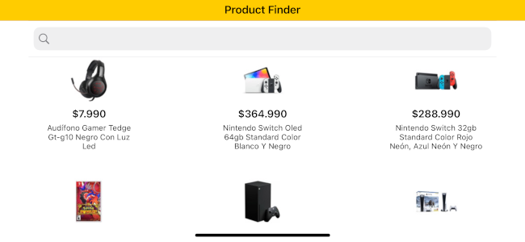

Product Finder
==============

Esta sencilla aplicación te permite buscar articulos relacionados con vídeos juegos.  
Es posible usarla en modo portrait y landscape.

Componentes visuales
- Pantalla principal que muestra un listado de productos y permite hacer búsquedas.
- Pantalla detalle que muestra las caracteristicas de un producto.

Detalles de su implementación
- La arquitectura usada es CleanSwift.
- Librerías incluidas con CocoaPods.
    - AlamoFire
    - SDWebImage
- Incluye tests unitarios en todas sus componentes.

Notas
- Para descargar sus dependencias se debe correr: ```pod install```

Screenshots

  
  
  
  